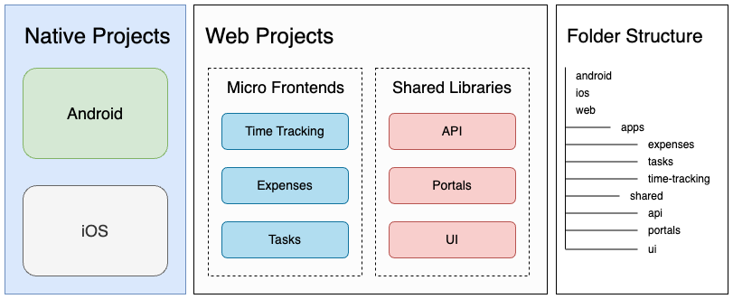

# Portals Training & Tutorials Demo

## Overview

This repository hosts **Jobsync**, a fictional employee management system built using <a href="https://ionic.io/portals" target="_blank">Ionic Portals</a>.

Jobsync is a superapp; a project containing thin native applications that facilitate launching and communicating with micro frontends containing application features such as time tracking, expense reporting, and task management. 

Educational materials using Jobsync are applicable to any type of Portals project although the text may be framed within the context of building a superapp. In short, there are no technical differences between a superapp Portals project and a non-superapp Portals project.

## Project Architecture

Jobsync is a monorepo containing an Android application, an iOS application, 3 web micro frontends and 3 shared web libraries.

Portals projects are not required to be structured within a monorepo setup. However, Ionic has found that monorepos are the most convenient setup to maintain demos that encompass such a large scope.

## Building

Platform-specific build instructions can be found at the following local links:

- [Web](./docs/build.md#Web)
- [iOS](./docs/build.md#iOS)
- [Android](./docs/build.md#Android)

## Tagging Structure

Each tag in this repository corresponds with a particular training or tutorial.

The Portals Onboarding training has different starting points based on audience:

- `start-web` is the tag that should be checked out for web development
- `start-native` is the tag that should be checked out for iOS/Android development

The completion of the Portals Onboarding training converges with the `v1.0` tag. 

The output of additional trainings or tutorials will be indicated by tags starting with `end-`. For instance, the end state of the "Using Core Capacitor Plugins" training would be `end-core-capacitor-plugins`.   